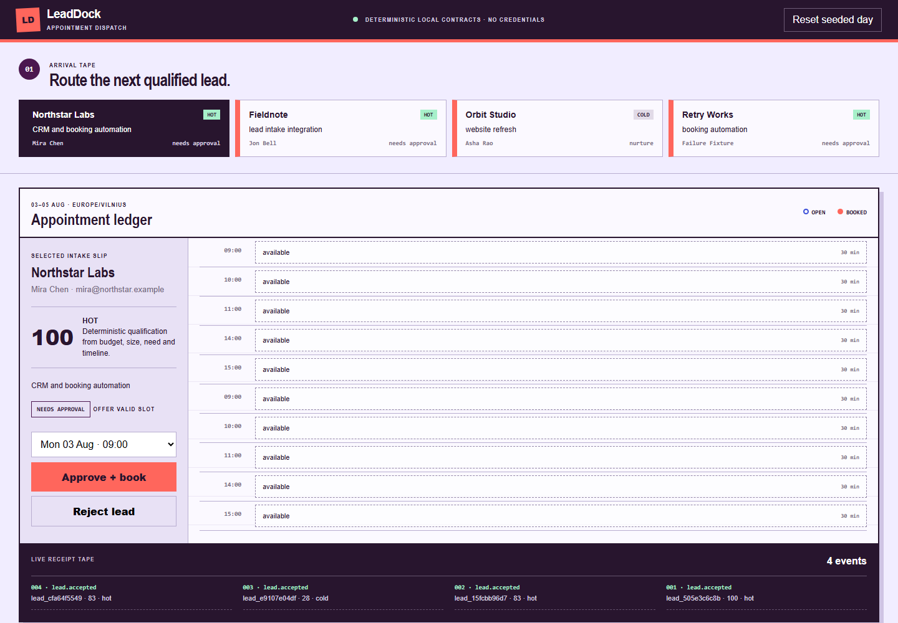

# LeadDock

LeadDock is a lead-intake, qualification, CRM, and appointment-booking
workflow. A lead enters through HTTP or the importable n8n workflow, is
validated and deduplicated, receives a rules-based qualification result, waits
for approval, then reaches a local CRM upsert, timezone-aware calendar booking,
outbound handoff, and chronological audit trail.



[Open the live booking workspace](https://sutasmantas.github.io/ai-lead-intake-automation/)

## Two-minute quickstart

Requires Python 3.11+.

```powershell
python -m leaddock.server
```

Open `http://127.0.0.1:4310`, select a qualified arrival, choose an available
slot, and click **Approve + book**. The UI shows the CRM receipt, booking,
handoff, and audit events. Select **Retry Works**, approve it, then replay the
deliberately dead-lettered handoff from the recovery pocket.

Run all focused evidence:

```powershell
python -m unittest discover -s tests -v
python -m json.tool workflows/leaddock-intake-booking.json > $null
docker run --rm -v "${PWD}:/data" n8nio/n8n:2.30.5 import:workflow --input=/data/workflows/leaddock-intake-booking.json
```

## n8n workflow

Import `workflows/leaddock-intake-booking.json` into n8n. Set `LEADDOCK_URL` to
the reachable local service base URL when n8n does not run on the same host.
The workflow exposes separate intake and approval webhooks and calls the same
contracts exercised by the local UI and tests.

## What it handles

- deterministic validation, normalization, deduplication, and qualification;
- explicit approval and rejection branches;
- generic CRM field mapping and idempotent upsert behavior;
- IANA timezone validation, UTC storage, availability, idempotent booking, and
  double-book prevention;
- bounded outbound retry, dead-letter, replay, receipts, and audit history;
- importable n8n orchestration and a credential-free local workflow.
